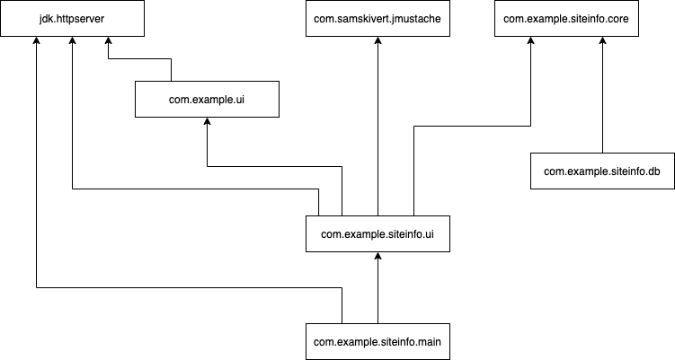

August 12, 2021

An experiment to build a simple app using tinyjhttpd, Java 9 modules, 
and a clean architecture.

To run, type `make; ./start.sh`.

The goal was to build a pure Java server that will
* operate in an environment with only 250 MB of RAM, and
* see how much work it is to wire together independent component.

This repo is purposfully over-engineered---no YAGNI here.  I implemented every 
boundary I could see:

A box is a component (a Java 9 module) and each arrow points toward a 
dependency; for example,
`core` has no dependencies
and `db` depends on `core`.

With 
this module setup, 
you can drop an updated `com.example.siteinfo.db` module into the
mlib dir, and 
restart the server to move from the current stubbed implementation
to a real one.  If you guess right about your 
component boundaries, you can both develop and deploy changes to one 
module without touching code in any other modules.  That's a big "if",
but it's not a lot of extra work 
and the potential win is big.

Especially if you consider the set of business entities in a real-world
project. This dummy project 
has the one `siteinfo` entity, 
but in a real world project you will have many more entities, and they 
will want to talk to each
other.  If you can limit this "conversation" to the use cases defined in the
core components, and use the ServiceLoader (or other dependency injection 
mechanism),
you will have a good handle on complexity even as your 
system grows large.  For example, with this in place it would be much 
lower risk
to  split up your one huge database schema into smaller, entity-specific 
schemas (once you settle how to handle race conditions around 
foreign key constraints  ;)
). You could
have one monolith or many micro services---either approach would use the
same core, db, and (possibly) ui modules.

Since java.util.ServiceLoader
has been around since Java 1.6, this approach will work with Java 8.  You just
will need more RAM, as I think the full Java runtime environment
will add around 200 MB.

The following links were useful:

  * The blog post _Java 9 Module Services_ by Peter Verhas on Jan. 14, 2018 was my 
    primary source: https://dzone.com/articles/java-9-module-services

  * The source code for the above article is here: https://github.com/verhas/module-test

  * The ServiceLoader that comes with Java (and which I first learned about from the 
    above blog) is amazing.
  https://docs.oracle.com/en/java/javase/11/docs/api/javabase/java/util/ServiceLoader.html

  * Lastly, Uncle Bob's book and blog are great: 
https://blog.cleancoder.com/uncle-bob/2012/08/13/the-clean-architecture.html (2012) 
and https://www.oreilly.com/library/view/clean-architecture-a/9780134494272/ (2017).

-- Mark
